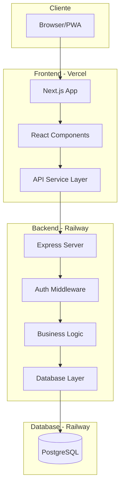
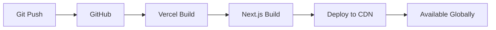
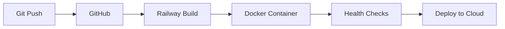

# Arquitectura del Sistema - Alliance F&R

## 📋 Visión General

Alliance F&R está construido con una arquitectura moderna de aplicación web, separando claramente el frontend del backend, con énfasis en la escalabilidad, seguridad y mantenibilidad.



## 🏗️ Arquitectura Frontend

### Stack Tecnológico
- **Framework**: Next.js 14.2.31 (Pages Router)
- **UI Library**: React 18.2.0
- **Styling**: Tailwind CSS 3.3.0
- **State Management**: React Hooks + Context
- **HTTP Client**: Fetch API con abstracción personalizada

### Estructura de Directorios

```
src/
├── pages/                 # Páginas de Next.js
│   ├── _app.js           # App wrapper con ErrorBoundary
│   ├── _document.js      # Documento HTML personalizado
│   └── index.js          # Página principal (SPA)
├── features/             # Módulos de funcionalidades
│   ├── auth/            # Login y autenticación
│   ├── clients/         # Gestión de clientes
│   ├── financial-ops/   # Operaciones financieras
│   └── user-management/ # Gestión de usuarios
├── shared/              # Código compartido
│   ├── components/      # Componentes reutilizables
│   ├── services/        # Servicios (API, cache, etc.)
│   ├── hooks/          # Custom hooks
│   └── utils/          # Utilidades
└── styles/             # Estilos globales
```

### Patrones de Diseño

#### 1. **Component Composition**
```jsx
// Componentes pequeños y reutilizables
<NavigationApp>
  <MenuItem />
  <SubMenu />
</NavigationApp>
```

#### 2. **Custom Hooks**
```jsx
// Lógica reutilizable
const { user, loading, error } = useAuth()
const { navigate, currentPage } = useNavigation()
```

#### 3. **Service Layer**
```javascript
// Abstracción de API
const apiService = {
  login: (email, password) => {...},
  getClients: () => {...},
  createMovement: (data) => {...}
}
```

### Optimizaciones de Performance

1. **Code Splitting**: Lazy loading de componentes grandes
2. **Memoization**: React.memo para componentes puros
3. **Debouncing**: En búsquedas y filtros
4. **Virtual Scrolling**: Para listas largas (pendiente)
5. **Service Worker**: Para capacidades offline (PWA)

## 🔧 Arquitectura Backend

### Stack Tecnológico
- **Runtime**: Node.js 18+
- **Framework**: Express 4.18.2
- **Database**: PostgreSQL 16
- **ORM**: SQL directo con pg
- **Auth**: JWT + bcrypt
- **Docs**: Swagger/OpenAPI

### Estructura del Servidor

```javascript
// server-minimal.js - Estructura principal
├── Configuración inicial
│   ├── Variables de entorno
│   ├── Validaciones
│   └── Inicialización de servicios
├── Middleware
│   ├── CORS
│   ├── Body parsing
│   ├── Swagger UI
│   └── Auth middleware
├── Database
│   ├── Connection pool
│   ├── Query executor
│   └── Auto-reconnect
├── Routes
│   ├── /api/auth/*
│   ├── /api/users/*
│   ├── /api/clients/*
│   └── /api/movements/*
└── Error handling & Graceful shutdown
```

### Capas de la Aplicación

#### 1. **Presentation Layer** (Routes)
- Maneja HTTP requests/responses
- Validación de entrada
- Serialización de salida

#### 2. **Business Logic Layer**
- Reglas de negocio
- Validaciones complejas
- Cálculos y transformaciones

#### 3. **Data Access Layer**
- Queries SQL parametrizadas
- Connection pooling
- Transacciones

### Seguridad

1. **Autenticación**
   - JWT con expiración configurable
   - Refresh tokens (pendiente)
   - Session management

2. **Autorización**
   - Roles: admin, operator, viewer
   - Permisos granulares por módulo
   - Middleware de verificación

3. **Protección de Datos**
   - Passwords hasheados (bcrypt 10 rounds)
   - SQL injection prevention
   - XSS protection
   - CORS configurado

## 💾 Arquitectura de Base de Datos

### Esquema Principal

```sql
-- Tabla de usuarios
users (
  id SERIAL PRIMARY KEY,
  name VARCHAR(255),
  username VARCHAR(100) UNIQUE,
  email VARCHAR(255) UNIQUE,
  password VARCHAR(255),
  role VARCHAR(50),
  permissions TEXT[],
  active BOOLEAN,
  created_at TIMESTAMP,
  updated_at TIMESTAMP
)

-- Tabla de clientes
clients (
  id SERIAL PRIMARY KEY,
  nombre VARCHAR(255),
  apellido VARCHAR(255),
  dni VARCHAR(50),
  telefono VARCHAR(100),
  email VARCHAR(255),
  direccion TEXT,
  tipo_cliente VARCHAR(100),
  notas TEXT,
  created_at TIMESTAMP,
  updated_at TIMESTAMP
)

-- Tabla de movimientos
movements (
  id SERIAL PRIMARY KEY,
  tipo_operacion VARCHAR(100),
  sub_operacion VARCHAR(100),
  monto DECIMAL(15,2),
  moneda VARCHAR(50),
  fecha DATE,
  cliente_id INTEGER REFERENCES clients(id),
  descripcion TEXT,
  estado VARCHAR(50),
  metadata JSONB,
  created_at TIMESTAMP,
  updated_at TIMESTAMP
)
```

### Índices y Optimización

```sql
-- Índices para búsquedas frecuentes
CREATE INDEX idx_movements_fecha ON movements(fecha);
CREATE INDEX idx_movements_cliente ON movements(cliente_id);
CREATE INDEX idx_clients_dni ON clients(dni);
CREATE INDEX idx_users_email ON users(email);
```

## 🚀 Flujo de Deployment

### Frontend (Vercel)



### Backend (Railway)



## 📊 Monitoreo y Observabilidad

### Métricas Clave

1. **Frontend**
   - Core Web Vitals (LCP, FID, CLS)
   - JS Bundle size
   - API response times
   - Error rates

2. **Backend**
   - Request latency (p50, p95, p99)
   - Database query performance
   - Memory usage
   - CPU utilization

3. **Database**
   - Query execution time
   - Connection pool usage
   - Lock contention
   - Index efficiency

### Logging

```javascript
// Estructura de logs
{
  timestamp: "2024-01-10T10:30:00Z",
  level: "error|warn|info|debug",
  service: "auth|api|db",
  message: "Descripción del evento",
  metadata: {
    userId: 123,
    requestId: "uuid",
    duration: 150
  }
}
```

## 🔄 Patrones de Integración

### API Communication

```javascript
// Request flow
Client -> API Service -> Fetch -> Backend -> PostgreSQL
       <- Response    <- JSON  <- Express <- Query Result
```

### Error Handling

```javascript
try {
  // Business logic
} catch (error) {
  // Log error
  logger.error('Operation failed', { error, context })
  
  // Return user-friendly error
  res.status(500).json({
    success: false,
    message: 'Operación fallida',
    code: 'OPERATION_FAILED'
  })
}
```

### Caching Strategy

1. **Client-side**
   - Service Worker cache para assets
   - Memory cache para datos frecuentes
   - SessionStorage para estado temporal

2. **Server-side**
   - Connection pooling
   - Query result caching (pendiente)
   - Static asset caching

## 🛡️ Consideraciones de Seguridad

### Principios OWASP Aplicados

1. **Injection Prevention**
   - Parameterized queries
   - Input validation
   - Output encoding

2. **Authentication**
   - Strong password policy
   - Account lockout mechanism
   - Secure session management

3. **Data Protection**
   - HTTPS everywhere
   - Encryption at rest
   - Minimal data exposure

4. **Security Headers**
   - Content Security Policy
   - X-Frame-Options
   - X-Content-Type-Options

## 🔮 Roadmap Técnico

### Corto Plazo (1-3 meses)
- [ ] Implementar refresh tokens
- [ ] Agregar rate limiting
- [ ] Mejorar sistema de caché
- [ ] Implementar websockets para real-time

### Mediano Plazo (3-6 meses)
- [ ] Migrar a TypeScript
- [ ] Implementar GraphQL
- [ ] Agregar tests E2E
- [ ] Implementar CI/CD completo

### Largo Plazo (6-12 meses)
- [ ] Microservicios architecture
- [ ] Kubernetes deployment
- [ ] Event-driven architecture
- [ ] Machine learning para análisis

## 📚 Referencias y Recursos

- [Next.js Documentation](https://nextjs.org/docs)
- [PostgreSQL Best Practices](https://wiki.postgresql.org/wiki/Main_Page)
- [OWASP Security Guidelines](https://owasp.org/)
- [Railway Documentation](https://docs.railway.app/)
- [Vercel Documentation](https://vercel.com/docs)

---

**Última actualización**: Enero 2024